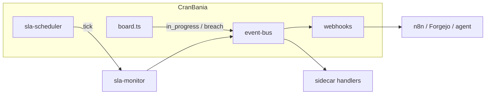

# CranBania architecture

Modular, zero-cost, self-hosted Kanban + ITSM-lite. This document maps attached **Convex skills** to what CranBania actually implements (JSON + Next.js, not Convex).

## Design principles

| Principle | How |
|-----------|-----|
| Modular | `lib/services/*` — auth, events, SLA scheduler, migrations |
| Dynamic | Adaptive SLA poll interval (30s–10min) based on breach activity |
| Proactive | Auto-sprint assign, SLA on create/move, optional background poller |
| Automated | Event bus → webhooks → n8n / Forgejo / agents |
| Future-proof | Versioned JSON migrations, export/import, MCP + REST parity |

## Module map

```
lib/
├── services/
│   ├── auth.ts           ← auth-setup skill (API keys, not WorkOS)
│   ├── event-bus.ts      ← components-guide (orchestration hooks)
│   ├── sla-scheduler.ts  ← adaptive automation (no GitHub required)
│   └── migrations.ts     ← migration-helper
├── automation/
│   ├── forgejo-dispatch.ts ← Forgejo workflow dispatch on card events
│   ├── register.ts       ← startup sidecar registration
│   └── status.ts           ← shared automation status builder
├── schemas/
│   └── card.ts           ← schema-builder + function-creator validators
├── board.ts              ← domain CRUD
├── workspace.ts          ← sprints / epics
├── sla-monitor.ts        ← ITSM breach logic
└── webhooks.ts           ← outbound integrations
```

## Convex skills — implemented here?

You attached Convex plugin skills. **CranBania does not use Convex** (zero-cost mandate: no hosted backend subscription). Equivalents:

| Attached skill | CranBania equivalent | Location |
|----------------|---------------------|----------|
| **auth-setup** | Optional `CRANBANIA_CRON_SECRET` / `CRANBANIA_API_KEY` | `lib/services/auth.ts` |
| **components-guide** | Service modules + event bus sidecars | `lib/services/event-bus.ts` |
| **convex-helpers-guide** | Custom validators + modular auth wrappers | `lib/schemas/`, `lib/services/auth.ts` |
| **convex-quickstart** | N/A — use `npm run dev` + `AGENTS.md` | — |
| **function-creator** | Zod-validated API routes + typed lib functions | `app/api/*`, `lib/schemas/` |
| **migration-helper** | Versioned `board.json` migrations | `lib/services/migrations.ts` |
| **schema-builder** | Zod + TypeScript types | `lib/types.ts`, `lib/schemas/card.ts` |

**Not migrating to Convex** unless the £0 mandate changes — would add hosted dependency and rewrite storage.

## Integrations reviewed (Cursor skills & stack)

| Integration | Helps CranBania? | Usage |
|-------------|------------------|--------|
| **MCP** (`npm run mcp`) | **Yes** | Primary agent interface |
| **Outbound webhooks** | **Yes** | n8n, Forgejo relay, custom agents |
| **Forgejo Actions + dispatch API** | **Yes** | SLA cron + agent workflows via sidecar |
| **Woodpecker CI** | **Yes** | `.woodpecker/*.yaml` cron pipelines |
| **GitHub Actions** | Optional | Documented but not required |
| **n8n self-hosted** | **Yes** | Webhook + schedule |
| **Cloudflare Workers** | Optional | Could host relay; not required |
| **Supabase / Convex / Clerk** | **No** | Conflicts with JSON-first zero-cost design |
| **Stripe / paid ITSM** | **No** | Out of mandate |

## Event flow



## Automation status API

`GET /api/automation/status` — scheduler state, webhook counts, data versions, recommendations.

## Extending (future-proof)

1. **Add sidecar:** `registerCardEventSidecar()` in a small `lib/automation/custom.ts` imported from `instrumentation.ts`.
2. **Add migration:** bump `BOARD_DATA_VERSION`, add step in `migrateBoard()`.
3. **Add validator:** extend `lib/schemas/card.ts`, use in API route.
4. **Forgejo agent:** webhook → your Forgejo API `repository_dispatch` or Woodpecker CI.

See `docs/automation-recipes.md` for SLA polling without GitHub.
